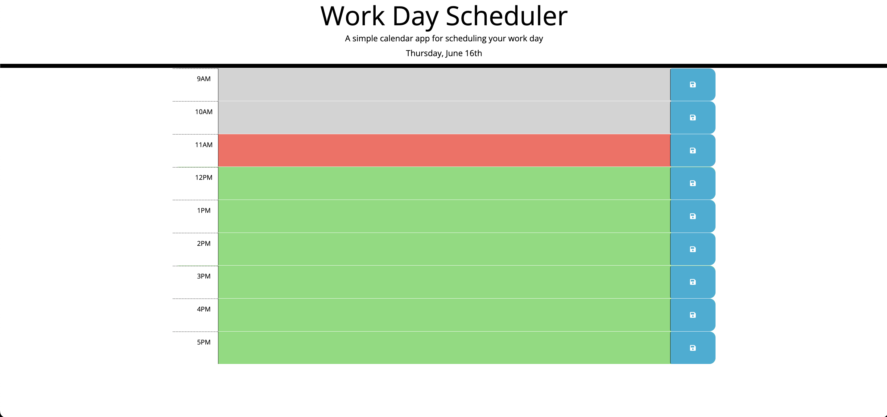

# Key To a Great Day

## Description

My motivation for this project was to create a calander that would keep users notes in local storage so they can see them even if they leave the page. The time blocks are color coded with grey meaning that it has went past that hour, red meaning that it is the current hour, and green meaning that hour has yet to come.

## Contributing

If you would like to contribute please fork the repo and submit a pull request.

## Questions

If you have any questions please reach out by going to my profile where you will find my email.

URL: https://jessemarino.github.io/key_to_a_great_day/
